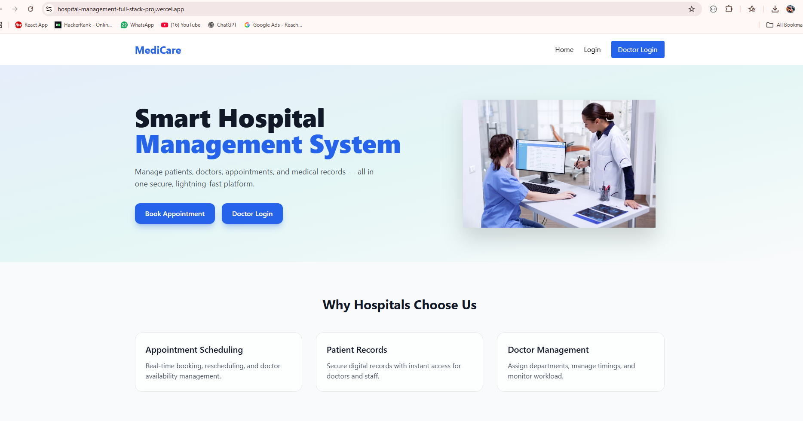

# 🏥 Hospital Management System (Full Stack)

A modern **MERN stack Hospital Management System** that allows patients
to book appointments and doctors to manage and approve them.\
Built with **React (Vite)**, **Node.js**, **Express**, and **MongoDB
Atlas**, deployed using **Render (Backend)** and **Vercel (Frontend)**.

------------------------------------------------------------------------

## 🌐 Live Demo

-   **Frontend (Vercel):** https://hospital-management-full-stack-proj.vercel.app/
-   **Backend API (Render):**
    https://hospital-management-full-stack-project-y4gv.onrender.com

------------------------------------------------------------------------



```

------------------------------------------------------------------------

## ✨ Features

### 👨‍⚕️ Doctor Module

-   Doctor Login
-   View assigned appointments
-   Approve / Reject patient appointments
-   Status update in real-time

### 🧑‍🤝‍🧑 Patient Module

-   User Signup & Login
-   Book appointments
-   View appointment status
-   Secure authentication using JWT

### ⚙️ System Features

-   Role-based authentication (Patient / Doctor)
-   MongoDB Atlas cloud database
-   REST API architecture
-   Responsive UI with Tailwind CSS
-   Production deployment ready

------------------------------------------------------------------------

## 🛠 Tech Stack

**Frontend** - React (Vite) - Tailwind CSS - Axios - React Router

**Backend** - Node.js - Express.js - MongoDB Atlas - JWT
Authentication - bcrypt

**Deployment** - Frontend → Vercel - Backend → Render - Database →
MongoDB Atlas

------------------------------------------------------------------------

## 📁 Project Structure

    Hospital-Management-Full-Stack-Project
    │
    ├── Backend
    │   ├── controllers
    │   ├── routes
    │   ├── models
    │   ├── middleware
    │   └── server.js
    │
    ├── Frontend
    │   ├── src
    │   ├── public
    │   ├── .env
    │   └── vite.config.js
    │
    └── README.md

------------------------------------------------------------------------

## 🔑 Environment Variables

### Frontend (.env)

    VITE_API_URL=https://hospital-management-full-stack-project-y4gv.onrender.com

### Backend (.env)

    MONGO_URI=your_mongodb_connection_string
    JWT_SECRET=your_secret_key
    PORT=4000

------------------------------------------------------------------------

## 🚀 Local Setup

### 1️⃣ Clone Repository

    git clone https://github.com/your-username/Hospital-Management-Full-Stack-Project.git

### 2️⃣ Install Backend Dependencies

    cd Backend
    npm install
    npm run dev

### 3️⃣ Install Frontend Dependencies

    cd Frontend
    npm install
    npm run dev

------------------------------------------------------------------------

## 🔒 Authentication Flow

1.  User/Doctor logs in
2.  JWT token stored in localStorage
3.  Token sent in Authorization header
4.  Protected routes validated using middleware

------------------------------------------------------------------------

## 📌 Future Enhancements

-   Admin panel
-   Appointment notifications
-   Doctor availability scheduling
-   Payment integration
-   Email confirmation

------------------------------------------------------------------------

## 👨‍💻 Author

**Yash Deliwala**\
Full Stack Developer\
🌐 https://www.yashdeliwala.com

------------------------------------------------------------------------

⭐ If you like this project, give it a star!
